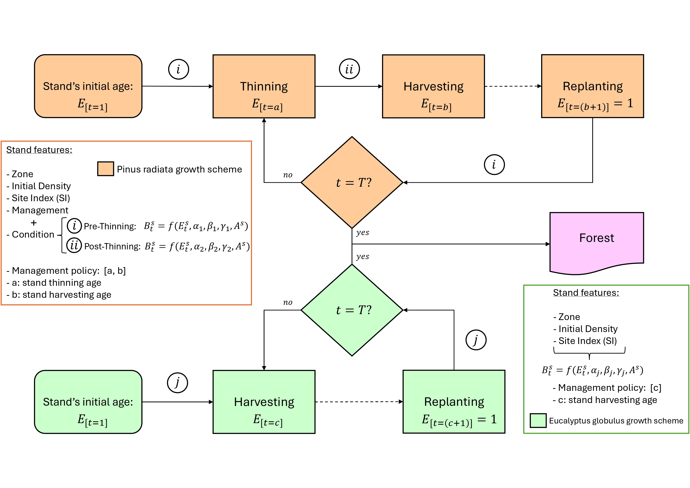
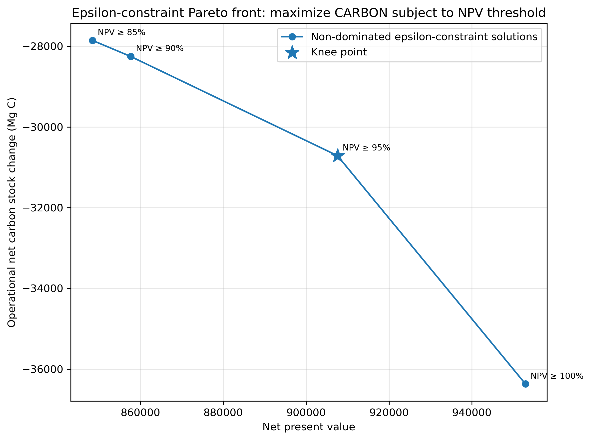

# Treemun: growth, yield, optimization, and carbon-aware decision support framework for Chilean plantation forests

[](https://badge.fury.io/py/treemun-sim)
[](https://www.python.org/downloads/)
[](LICENSE)

**treemun-sim** is a Python package for simulating, optimizing, and spatially exporting forest plantation management policies for *Pinus radiata* and *Eucalyptus globulus* stands. It combines a discrete-time growth-and-yield simulator, a mixed-integer programming optimization model, optional carbon-stock proxy accounting, multi-objective decision-support tools, Pareto and epsilon-constraint front generation, and GIS export of optimized stand-level policies.

> **Version:** `1.3.0`  
> **Distribution name:** `treemun-sim`  
> **Import name:** `treemun_sim`  
> **Core species:** *Pinus radiata* and *Eucalyptus globulus*  
> **Core model type:** discrete-time simulation + mixed-integer linear programming (MILP)
> **Maintainer:** Felipe Ulloa-Fierro <fauf2507 at gmail.com>

---

## Contents

- [Main features](#main-features)
- [Tool objectives](#tool-objectives)
- [Empirical and methodological foundation](#empirical-and-methodological-foundation)
- [Forest stand classification](#forest-stand-classification)
- [Notation and naming conventions](#notation-and-naming-conventions)
- [Simulator mathematical foundation](#simulator-mathematical-foundation)
- [Carbon proxy](#carbon-proxy)
- [Optimization model](#optimization-model)
- [Objective modes](#objective-modes)
- [Bi-objective formulation](#bi-objective-formulation)
- [Weighted Pareto front](#weighted-pareto-front)
- [Epsilon-constraint front](#epsilon-constraint-front)
- [Spatial export](#spatial-export)
- [Installation](#installation)
- [Full pipeline examples](#full-pipeline-examples)
- [API reference](#api-reference)
- [Output data structures](#output-data-structures)
- [Citation](#citation)
- [References](#references)

---

## Main features

- Stand-level growth and yield simulation for *Pinus radiata* and *Eucalyptus globulus* plantations.
- Configurable management policies:
  - *Pinus radiata*: thinning + final harvest policies.
  - *Eucalyptus globulus*: harvest-only rotation policies.
- Random synthetic landscape generation or loading of user-defined stands from CSV/TXT files.
- Stand-policy simulation catalog for all feasible management alternatives.
- Optimization-ready dictionaries for final standing volume and period-level removed volume.
- MILP-based stand-policy assignment model.
- NPV maximization, carbon-stock-change maximization, and weighted (bi-objective) NPV-carbon optimization.
- Optional even-flow relaxation through `even_flow_tolerance`.
- Optional carbon proxy post-processing using species-specific wood density and carbon fraction parameters.
- Weighted Pareto front generation, plotting, knee-point detection, and report export.
- Epsilon-constraint front generation in both directions, plotting, knee-point detection, and report export.
- Spatial export of selected optimized policies to Shapefile or GeoPackage.
- Optional spatial export of simulated biomass and carbon trajectories associated with the selected optimal policy.

---

## Tool objectives

`treemun-sim` aims to:

1. Simulate stand-level forest development under alternative management policies across finite planning horizons.
2. Generate optimization-ready policy catalogs where each stand is associated with one or more feasible management prescriptions.
3. Support forest management optimization planning.
4. Enable carbon-aware decision support by adding a transparent proxy for above-ground live carbon-stock changes.
5. Support multi-objective analysis of economic return and carbon-stock-change trade-offs.
6. Provide GIS-ready outputs so selected stand-level policies can be visualized and analyzed spatially.

---

## Empirical and methodological foundation

The growth component implemented was derived from published Chilean production tables for *Pinus radiata* and *Eucalyptus globulus*, which provide model-based stand-level trajectories across combinations of geographical zone, site index, initial density, management regime, and stand condition (Corvalán & Hernández, 2011; Hernández & Corvalán, 2012).  

For *Eucalyptus globulus*, the biomass tables combined published equations and records from previous studies, with the equations from the EUCASIM v4.4 stand-level model simulator (Modelo Nacional de Simulación, 2024), itself fitted to a network of trials and permanent plots across three growth zones; they combined projections for ages 3–18 years in high forest and 3–15 years in coppice, wood-density data from 550 sampled trees, and volume-partition functions based on 12 high-forest and 5 coppice studies. For *Pinus radiata*, stem volume trajectories were derived from INSIGNE v1.2.2 (Modelo Nacional de Simulación, 2024) volume projections, multiplied by age-dependent wood density, while non-stem volume was estimated with a partition model fitted to 118 stands compiled from published biomass studies. The combined source material resulted in 672 standardized stand-level configurations, spanning different site conditions, management intensities, and geographic locations across the coastal and coastal mountain range sectors of the main Chilean forestry regions considered in the original studies: Libertador Bernardo O'Higgins, Maule, and Biobío. 

To provide a standardized and computationally accessible representation of these trajectories, Miranda et al., (2023) fitted species- and stratum-specific surrogate functions to tabulated reference values ​​using the functional structure reported in the source studies mentioned above.

The optimization module follows the logic of Model I forest planning formulations, where each management unit is assigned one complete management schedule over the planning horizon. This tradition is closely related to the timber harvest scheduling formulations discussed by Johnson and Scheurman (1977).

Version `1.3.0` adds carbon-aware post-processing and optimization capabilities. The carbon proxy is intentionally transparent: it converts simulated volume into above-ground live carbon using species-specific basic density and carbon fraction coefficients (Miranda et al., 2015; Watt & Trincado, 2019; Olmedo et al., 2020).

---

## Forest stand classification

The growth equations depend on species-specific ecological and management dimensions. The supported combinations follow the validated stand classes available in the underlying growth tables.

| Dimension | *Pinus radiata* | *Eucalyptus globulus* |
|---|---|---|
| Geographic zone | Z6-Z7 | Z01-Z02 |
| Site index | 23, 26, 29, 32 | 24, 26, 28, 30, 32 |
| Management regime | Pulpable, Multipurpose, Intensive 1 or 2 | Unmanaged |
| Stand condition | Managed | Unmanaged |
| Initial density | 1250 trees/ha | 800 or 1250 trees/ha |

---

## Notation and naming conventions

Version `1.3.0` uses a consistent notation to avoid confusion between simulator outputs, optimization parameters, and optimization decision variables.

### Indices and sets

| Symbol | Meaning |
|---|---|
| \(s\in S\) | Forest stand or management unit. |
| \(j\in J_s\) | Feasible management policy for stand \(s\). |
| \(t\in T=\{1,\ldots,H\}\) | Planning period. |
| \(sp(s)\) | Species of stand \(s\), either *Pinus radiata* or *Eucalyptus globulus*. |

### Core volume and biomass-related notation

| Symbol | Package object / column | Meaning |
|---|---|---|
| \(Q_{sjt}\) | `biomasa` column in each trajectory DataFrame | Simulated standing volume (biomass) output for stand \(s\), policy \(j\), period \(t\). |
| \(R_{sjt}\) | `bioOPT`; `removed_volume_by_period`; API argument `a_i_j_t` | Removed/harvested volume (biomass) in period \(t\). This is the period-level value used in optimization. |
| \(F_{sj}\) | `final_standing_volume`; API argument `a_i_j_T` | Final standing volume (biomass) value at the end of the horizon. |
| \(H_t\) | Pyomo variable `harvest_volume[t]` | Total removed/harvested volume (biomass) across the landscape in period \(t\). |
| \(F_{\min}\) | API argument `min_ending_biomass` | Minimum final standing volume (biomass) required at the end of the horizon. |

The API argument names `a_i_j_t` and `a_i_j_T` are retained for backward compatibility. In this README they should be interpreted as \(R_{sjt}\) and \(F_{sj}\), respectively.

### Carbon notation

| Symbol | Package object / column | Meaning |
|---|---|---|
| \(C^{pre}_{sjt}\) | `CarbonStockPre_MgC` | Pre-operation above-ground live carbon stock. |
| \(C^{rem}_{sjt}\) | `RemovedCarbon_MgC` | Carbon associated with removed volume \(R_{sjt}\). |
| \(C^{post}_{sjt}\) | `CarbonStockPost_MgC` | Post-operation above-ground live carbon stock. |
| \(\Delta C_{sjt}\) | `CarbSeq_MgC` | Net operational change in above-ground live carbon stock. |
| \(c_{sjt}\) | `CarbSeqOPT`; `carbon_change_by_period`; API argument `carbon_i_j_t` | Optimization-aligned carbon-stock-change proxy. |

### Returned object names used in examples

| Object | Meaning |
|---|---|
| `forest_trajectories` | List of simulated stand-policy trajectories. Each element is a `pandas.DataFrame`. |
| `policy_catalog` | Catalog of all simulated stand-policy alternatives. This is **not** an optimization result. |
| `final_standing_volume` | Dictionary mapping each stand-policy pair to \(F_{sj}\). Used by the optimization model. |
| `removed_volume_by_period` | Dictionary mapping each period-species-policy-stand tuple to \(R_{sjt}\). Used by the optimization model. |
| `carbon_change_by_period` | Dictionary mapping each period-species-policy-stand tuple to \(c_{sjt}\). Aligned with `removed_volume_by_period`. |

---

## Simulator mathematical foundation

Let:

- \(s\) denote a stand;
- \(j\in J_s\) denote a feasible management policy for stand \(s\);
- \(t\in\{1,\dots,H\}\) denote a discrete simulation period;
- \(E_{sjt}\) denote biological age under policy \(j\);
- \(A_s\) denote stand area;
- \(Q_{sjt}\) denote simulated standing volume output.

The general stand-level growth equation has the form:

\[
Q_{sjt} = \left[\alpha (E_{sjt})^\beta + \gamma\right] A_s,
\]

where \(\alpha\), \(\beta\), and \(\gamma\) are coefficients selected according to species, zone, site index, density, management regime, and stand condition.

If no harvest has occurred under policy \(j\), biological age evolves as:

\[
E_{sjt} = E_{sj0} + t - 1.
\]

After a harvest, the simulator assumes immediate regeneration, and age is reset according to the elapsed time since the last harvest:

\[
E_{sjt} = t - t^{last\_harvest}_{sj}.
\]

For each stand-policy-period combination, the simulator produces:

- \(Q_{sjt}\): simulated standing volume output (`biomasa`);
- \(R_{sjt}\): removed/harvested volume (`bioOPT`), equal to zero in periods without operations.

### Species-specific policy logic

*Pinus radiata* policies can include thinning and final harvest:

```python
(thinning_age, harvest_age)
```

For example:

```python
policy_pino 1 = (9, 18)
```

*Eucalyptus globulus* policies are represented by harvest age only:

```python
(harvest_age,)
```

For example:

```python
policy_eucalyptus 1 = (9,)
```

### Simulation logic figure

The original growth-simulation scheme can be shown as:



---

## Carbon proxy

Version `1.3.0` introduces an optional carbon proxy. It is activated with:

```python
Carbon=True,
return_carbon_opti=True
```

A carbon-enabled simulation returns five objects:

```python
forest_trajectories, policy_catalog, final_standing_volume, removed_volume_by_period, carbon_change_by_period = tm.simular_bosque(
    horizonte=10,
    num_rodales=100,
    semilla=123,
    Carbon=True,
    return_carbon_opti=True,
)
```

### Carbon-stock accounting equations

Let:

- \(Q^{pre}_{sjt}\): pre-operation standing volume for stand \(s\), policy \(j\), period \(t\);
- \(R_{sjt}\): removed/harvested volume, corresponding to `bioOPT`;
- \(Q^{post}_{sjt}\): post-operation standing volume;
- \(\rho_{sp}\): species wood basic density;
- \(CF_{sp}\): species carbon fraction;
- \(\alpha_{sp}=\rho_{sp}CF_{sp}\): carbon conversion coefficient.

Then:

\[
C^{pre}_{sjt}=\alpha_{sp(s)} Q^{pre}_{sjt},
\]

\[
C^{rem}_{sjt}=\alpha_{sp(s)} R_{sjt},
\]

\[
C^{post}_{sjt}=\alpha_{sp(s)} Q^{post}_{sjt}.
\]

The period-level net operational change in above-ground live carbon stock is:

\[
\Delta C_{sjt}=C^{post}_{sjt}-C^{post}_{sj,t-1}.
\]

For the first period, if an operation occurs, the proxy is initialized as:

\[
\Delta C_{sj1}=C^{post}_{sj1}-C^{pre}_{sj1}=-C^{rem}_{sj1}.
\]

The optimization-aligned proxy `CarbSeqOPT`, denoted by \(c_{sjt}\), is nonzero only in periods with operations:

\[
c_{sjt}=\begin{cases}
\Delta C_{sjt}, & \text{if } R_{sjt}>0,\\
0, & \text{otherwise.}
\end{cases}
\]

The package also reports CO\(_2\)-equivalent values using:

\[
CO_2e = C\times \frac{44}{12}.
\]

### Default carbon parameters

| Species | Basic density \(\rho\) | Carbon fraction \(CF\) | \(\alpha=\rho CF\) | \(\alpha_{CO2e}\) |
|---|---:|---:|---:|---:|
| *Eucalyptus globulus* | 0.567 Mg m\(^{-3}\) | 0.51 | 0.28917 Mg C m\(^{-3}\) | 1.06029 Mg CO\(_2e\) m\(^{-3}\) |
| *Pinus radiata* | 0.377 Mg m\(^{-3}\) | 0.48 | 0.18096 Mg C m\(^{-3}\) | 0.66352 Mg CO\(_2e\) m\(^{-3}\) |

The *Eucalyptus globulus* basic density default is based on the reported average basic density of coppiced trees in second rotation. The *Pinus radiata* value is based on reported mean juvenile wood basic density for Chilean radiata pine. The species carbon fractions follow values used for Chilean plantation carbon-stock calculations.

> **Important:** `CarbSeq_MgC` and `CarbSeqOPT` are proxies for net operational change in above-ground live carbon stock. They are not direct emissions, avoided emissions, total ecosystem carbon accounting, or a substitute for a full life-cycle analysis.

---

## Optimization model

The optimization model selects one simulated policy for each stand. It follows a Model-I-like structure: each binary decision variable corresponds to a complete management schedule for a stand.

### Sets

- \(S\): set of stands.
- \(J_s\): set of feasible policies for stand \(s\).
- \(T=\{1,\ldots,H\}\): set of planning periods.

### Decision variables

\[
x_{sj}=\begin{cases}
1, & \text{if policy } j \text{ is selected for stand } s,\\
0, & \text{otherwise.}
\end{cases}
\]

\[
H_t\ge 0 \quad \forall t\in T,
\]

where \(H_t\) is the total harvested/removed volume in period \(t\).

### Main parameters

| Symbol | Meaning | Package object / argument |
|---|---|---|
| \(R_{sjt}\) | Removed/harvested volume (biomass) from stand \(s\) under policy \(j\) in period \(t\). | `removed_volume_by_period`; API argument `a_i_j_t` |
| \(F_{sj}\) | Final standing volume (biomass) value for stand \(s\) under policy \(j\). | `final_standing_volume`; API argument `a_i_j_T` |
| \(p_{sp(s),t}\) | Revenue for the species of stand \(s\) in period \(t\). | `pine_revenue`, `eucalyptus_revenue` |
| \(r\) | Discount rate. | `discount_rate` |
| \(F_{\min}\) | Minimum required final standing volume (biomass). | `min_ending_biomass` |
| \(c_{sjt}\) | Optimization-aligned carbon-stock-change proxy. | `carbon_change_by_period`; API argument `carbon_i_j_t` |

### Constraints

Assignment:

\[
\sum_{j\in J_s}x_{sj}=1 \quad \forall s\in S.
\]

Harvest accounting:

\[
H_t=\sum_{s\in S}\sum_{j\in J_s}R_{sjt}x_{sj} \quad \forall t\in T.
\]

Ending standing-volume constraint:

\[
\sum_{s\in S}\sum_{j\in J_s}F_{sj}x_{sj}\ge F_{\min}.
\]

Even-flow with tolerance:

\[
H_{t+1}\ge (1-\delta)H_t \quad \forall t\in\{1,\ldots,H-1\},
\]

where \(\delta\) is `even_flow_tolerance`.

- `even_flow_tolerance=0.0` recovers \(H_{t+1}\ge H_t\).
- `even_flow_tolerance=0.10` allows \(H_{t+1}\ge 0.90H_t\).
- `even_flow_tolerance=1.0` practically disables the non-decreasing harvest condition.

Variable domains:

\[
x_{sj}\in\{0,1\}, \quad H_t\ge 0.
\]

---

## Objective modes

### 1. NPV maximization

```python
objective="npv"
```

\[
\max Z_{NPV}=\sum_{s\in S}\sum_{j\in J_s}\sum_{t\in T}
\frac{p_{sp(s),t}R_{sjt}}{(1+r)^t}x_{sj}.
\]

### 2. Carbon-stock-change maximization

```python
objective="carbon"
```

\[
\max Z_C=\sum_{s\in S}\sum_{j\in J_s}\sum_{t\in T}c_{sjt}x_{sj}.
\]

Because `CarbSeqOPT` values can be negative, maximizing \(Z_C\) means selecting policies with less negative operational changes in standing live above-ground carbon stock.

### 3. Weighted NPV-carbon objective

```python
objective="weighted"
```

\[
\max Z_W =
w_{NPV}\frac{Z_{NPV}}{S_{NPV}}+
w_C\frac{Z_C}{S_C},
\]

where:

\[
w_C=1-w_{NPV}.
\]

The terms \(S_{NPV}\) and \(S_C\) are scaling factors used to make the weighted sum numerically comparable.

---

## Bi-objective formulation

The underlying bi-objective planning problem can be written as:

\[
\max \left(Z_{NPV}(x), Z_C(x)\right)
\]

subject to:

\[
\sum_{j\in J_s}x_{sj}=1 \quad \forall s\in S,
\]

\[
H_t=\sum_{s\in S}\sum_{j\in J_s}R_{sjt}x_{sj} \quad \forall t\in T,
\]

\[
H_{t+1}\ge (1-\delta)H_t \quad \forall t\in\{1,\ldots,H-1\},
\]

\[
\sum_{s\in S}\sum_{j\in J_s}F_{sj}x_{sj}\ge F_{\min},
\]

\[
x_{sj}\in\{0,1\},\quad H_t\ge 0.
\]

This bi-objective structure allows the decision maker to explore trade-offs between economic value and operational carbon-stock-change performance.


## Weighted Pareto front

The function `build_weighted_pareto_front()` solves the weighted objective for a sequence of NPV weights:

\[
w_{NPV}\in\{0,0.1,0.2,\ldots,1.0\},
\quad
w_C=1-w_{NPV}.
\]

```python
pareto_df, fig, ax = tm.build_weighted_pareto_front(
    bosque=forest_trajectories,
    resumen=policy_catalog,
    a_i_j_T=final_standing_volume,
    a_i_j_t=removed_volume_by_period,
    carbon_i_j_t=carbon_change_by_period,
    horizon=10,
    weights=[0.5, 0.6, 0.7, 0.8, 0.9, 1.0],
    even_flow_tolerance=0.10,
    solver_name="cplex",
    gap=0.01,
    tee=False,
    make_plot=True,
    annotate_points=True,
    identify_knee=True,
    save_results=True,
    results_dir="outputs",
    run_name="weighted_pareto_npv_carbon",
)
```

The resulting `pareto_df` includes NPV, carbon value, objective value, non-dominated status, and knee-point status.

Example figure:


When `save_results=True`, the function writes a results directory with the front table, summary text file, PNG plot, selected policies, harvest trajectory \(H_t\), and per-model reports.

> In discrete MILP problems, the weighted-sum method may not recover all non-convex portions of the Pareto frontier. For this reason, `treemun-sim` also includes epsilon-constraint front generation.

---

## Epsilon-constraint front

The epsilon-constraint method chooses one objective as the primary objective and converts the other objective into an additional threshold constraint, while preserving all constraints of the base Model-I forest planning formulation.

Importantly, the epsilon-constraint models do **not** replace the base Model-I forest planning constraints. Each epsilon-constraint problem keeps the complete feasible region of the original optimization model, including:

- one-policy assignment per stand;
- harvest-volume accounting by period;
- minimum final standing-volume requirement;
- even-flow constraints;
- binary policy-selection variables;
- nonnegative harvest-volume variables.

Therefore, let \(\mathcal{X}\) denote the feasible set defined by the base Model-I constraints:

\[
\mathcal{X} =
\left\{
x,H:
\sum_{j\in J_s}x_{sj}=1 \quad \forall s\in S,
\right.
\]

\[
H_t=\sum_{s\in S}\sum_{j\in J_s}R_{sjt}x_{sj} \quad \forall t\in T,
\]

\[
\sum_{s\in S}\sum_{j\in J_s}F_{sj}x_{sj}\ge F_{\min},
\]

\[
H_{t+1}\ge (1-\delta)H_t \quad \forall t\in\{1,\ldots,H-1\},
\]

\[
\left.
x_{sj}\in\{0,1\},\quad H_t\ge 0
\right\}.
\]

The epsilon-constraint method then solves a sequence of single-objective MILP problems over this same feasible set \(\mathcal{X}\), adding one additional threshold constraint on the secondary objective.

### Direction A: maximize NPV subject to a carbon threshold

In this direction, NPV is maximized while requiring the selected plan to satisfy a minimum carbon-stock-change threshold:

\[
\max_{(x,H)\in\mathcal{X}} Z_{NPV}(x)
\]

subject to the additional epsilon constraint:

\[
Z_C(x)\ge \varepsilon_C.
\]

Equivalently, this problem keeps all base Model-I constraints and adds only one extra carbon-threshold constraint.

```python
epsilon_df, fig, ax = tm.build_epsilon_constraint_front(
    bosque=forest_trajectories,
    resumen=policy_catalog,
    a_i_j_T=final_standing_volume,
    a_i_j_t=removed_volume_by_period,
    carbon_i_j_t=carbon_change_by_period,
    horizon=10,
    primary_objective="npv",
    epsilon_on="carbon",
    epsilon_mode="absolute",
    n_epsilons=11,
    even_flow_tolerance=0.10,
    solver_name="cplex",
    gap=0.01,
    tee=False,
    make_plot=True,
    save_results=True,
    results_dir="outputs",
    run_name="epsilon_npv_with_carbon_thresholds",
)
```


Example figure generated by `build_epsilon_constraint_front()`:

<p align="center">
  
</p>

<p align="center">
  <em>Figure. Epsilon-constraint front for maximizing NPV subject to minimum carbon-stock-change thresholds. Each point corresponds to one MILP solved over the same base Model-I feasible region, plus one additional epsilon constraint.</em>
</p>

Decision-support interpretation:

> What is the maximum NPV achievable if the plan must satisfy at least a given carbon-stock-change level?

### Direction B: maximize carbon subject to an NPV threshold

In this direction, the carbon-stock-change objective is maximized while requiring the selected plan to retain at least a specified NPV level:

\[
\max_{(x,H)\in\mathcal{X}} Z_C(x)
\]

subject to the additional epsilon constraint:

\[
Z_{NPV}(x)\ge \varepsilon_{NPV}.
\]

Equivalently, this problem keeps all base Model-I constraints and adds only one extra NPV-threshold constraint.

```python
epsilon_df_npv, fig_npv, ax_npv = tm.build_epsilon_constraint_front(
    bosque=forest_trajectories,
    resumen=policy_catalog,
    a_i_j_T=final_standing_volume,
    a_i_j_t=removed_volume_by_period,
    carbon_i_j_t=carbon_change_by_period,
    horizon=10,
    primary_objective="carbon",
    epsilon_on="npv",
    epsilon_mode="relative",
    epsilons=[0.85, 0.90, 0.95, 1.00],
    even_flow_tolerance=0.10,
    solver_name="cplex",
    gap=0.01,
    tee=False,
    make_plot=True,
    save_results=True,
    results_dir="outputs",
    run_name="epsilon_carbon_with_npv_thresholds",
)
```

Example figure generated by `build_epsilon_constraint_front()`:

<p align="center">
  
</p>

<p align="center">
  <em>Figure. Epsilon-constraint front for maximizing carbon-stock-change performance subject to minimum NPV thresholds. Each point corresponds to one MILP solved over the same base Model-I feasible region, plus one additional NPV-threshold constraint.</em>
</p>


When `epsilon_mode="relative"` and `epsilon_on="npv"`, a value such as `0.90` means:

\[
Z_{NPV}\ge 0.90 Z_{NPV}^{max}.
\]

Decision-support interpretation:

> What is the best carbon-stock-change outcome achievable if the management plan must retain at least a given percentage of the maximum attainable NPV?

In other words, this direction is useful when the decision maker is willing to sacrifice part of the maximum economic return, but wants to understand how much carbon-stock-change performance can be improved while preserving minimum acceptable profitability levels.

### Knee-point detection

The package identifies a knee-like compromise solution using normalized distance to the ideal point. Let \(\widehat{Z}_{NPV}\) and \(\widehat{Z}_C\) denote normalized objective values. The knee point is selected as:

\[
i^* = \arg\min_i \sqrt{(1-\widehat{Z}_{NPV,i})^2+(1-\widehat{Z}_{C,i})^2}.
\]

Extract the knee point with:

```python
knee = epsilon_df_npv[epsilon_df_npv["is_knee"] == True].iloc[0]
print(knee)
```

---

## Spatial export

Spatial export is intentionally separate from front generation. Pareto and epsilon-front functions may solve many optimization models, while GIS export is usually applied to one selected solution, such as the NPV optimum, the carbon optimum, a weighted solution, or a knee-point solution selected from a front.

By default, `export_optimal_policy_to_shapefile()` preserves all original attributes in the input spatial file and adds only:

```text
opt_policy
```

This keeps the GIS output clean and easy to interpret.

```python
gdf_npv = tm.export_optimal_policy_to_shapefile(
    forest=forest_trajectories,
    summary=policy_catalog,
    shapefile_input="examples/shapefile/treemun_landscape.shp",
    shapefile_output="examples/shapefile/solutions/solution_npv.gpkg",
    solution=solution_npv,
)
```

GeoPackage (`.gpkg`) is recommended over Shapefile (`.shp`) when exporting many attributes.

If `biom_simu=True`, the function exports the simulated biomass volume trajectory associated with the selected optimal policy:

```python
gdf_npv_bio = tm.export_optimal_policy_to_shapefile(
    forest=forest_trajectories,
    summary=policy_catalog,
    shapefile_input="examples/shapefile/treemun_landscape.shp",
    shapefile_output="examples/shapefile/solutions/solution_npv_biomass.gpkg",
    solution=solution_npv,
    biom_simu=True,
)
```

For `policy_pino 1`, exported attributes include:

```text
bio_P1_t1, bio_P1_t2, ..., bio_P1_t10
```

If `carbseqSim=True`, the function exports `CarbSeq_MgC` from the selected simulated trajectory:

```python
gdf_npv_bio_carbon = tm.export_optimal_policy_to_shapefile(
    forest=forest_trajectories,
    summary=policy_catalog,
    shapefile_input="examples/shapefile/treemun_landscape.shp",
    shapefile_output="examples/shapefile/solutions/solution_npv_biomass_carbon.gpkg",
    solution=solution_npv,
    biom_simu=True,
    carbseqSim=True,
)
```

For `policy_pino 1`, exported carbon-stock-change attributes include:

```text
CSeqP1_t1, CSeqP1_t2, ..., CSeqP1_t10
```


## Example data and synthetic instances

`treemun-sim` can be used in two complementary ways:

1. loading a stand-level instance from a CSV/TXT file; or  
2. generating a synthetic random instance directly from the simulator.

The repository includes a reproducible example instance that allows users to run the complete `treemun-sim` workflow without preparing their own input data.

The example instance includes both a stand-level input table and a corresponding spatial layer:

```text
examples/
├── forest_stands.csv
└── shapefile/
    ├── treemun_landscape.shp
    ├── treemun_landscape.shx
    ├── treemun_landscape.dbf
    ├── treemun_landscape.prj
    └── solutions/
```

The file:

```text
examples/forest_stands.csv
```

contains a stand-level plantation instance with *Pinus radiata* and *Eucalyptus globulus* stands. This file can be passed directly to `simular_bosque()` through the `archivo_rodales` argument.

The spatial layer:

```text
examples/shapefile/treemun_landscape.shp
```

contains the corresponding landscape geometry for the same stand-level instance. The stand identifier field in the spatial layer must match the stand identifier used by the simulator:

```text
id_rodal
```

This common field allows `export_optimal_policy_to_shapefile()` to merge the selected optimization policy for each stand with the original spatial layer and generate GIS-ready outputs.

The `solutions/` directory is intended for generated spatial outputs, such as GeoPackage files (`.gpkg`) or Shapefiles (`.shp`). GeoPackage is recommended when exporting many attributes, especially when including period-level biomass or carbon trajectories.

> **Important:** when distributing the example spatial layer, all associated Shapefile components must be included together, at minimum `.shp`, `.shx`, `.dbf`, and `.prj`. Otherwise, GIS libraries may not be able to read the spatial layer correctly.

### Loading the included CSV instance

```python
import treemun_sim as tm

forest_trajectories, policy_catalog, final_standing_volume, removed_volume_by_period, carbon_change_by_period = tm.simular_bosque(
    archivo_rodales="examples/forest_stands.csv",
    policies_pino=[(9, 18), (10, 20), (11, 22)],
    policies_eucalyptus=[(9,), (10,), (11,)],
    horizonte=10,
    semilla=123,
    Carbon=True,
    return_carbon_opti=True,
)
```

This option is recommended when the user already has a stand-level inventory table or wants to reproduce the example instance distributed with the package.

### Generating a synthetic random instance

When no real stand-level inventory is available, `treemun-sim` can also generate a random synthetic plantation instance. This is useful for testing, teaching, benchmarking, and demonstrating the optimization workflow before using real data.

```python
import treemun_sim as tm

forest_trajectories, policy_catalog, final_standing_volume, removed_volume_by_period, carbon_change_by_period = tm.simular_bosque(
    num_rodales=50,
    policies_pino=[(9, 18), (10, 20), (11, 22)],
    policies_eucalyptus=[(9,), (10,), (11,)],
    horizonte=10,
    semilla=123,
    Carbon=True,
    return_carbon_opti=True,
)
```

The argument `semilla` controls reproducibility. Running the same code with the same seed will generate the same synthetic instance.

A synthetic instance can be optimized in the same way as a CSV-based instance:

```python
model_random_npv = tm.forest_management_optimization_model(
    bosque=forest_trajectories,
    a_i_j_T=final_standing_volume,
    a_i_j_t=removed_volume_by_period,
    horizon=10,
    objective="npv",
    even_flow_tolerance=0.10,
)

results_random_npv = tm.solve_model(
    model_random_npv,
    solver_name="cplex",
    gap=0.01,
    tee=False,
)

solution_random_npv = tm.extract_results(
    model_random_npv,
    results_random_npv,
)
```

> **Note:** random synthetic instances are not automatically associated with a real spatial layer. They can be used for simulation and optimization directly. Spatial export with `export_optimal_policy_to_shapefile()` requires a spatial file whose stand identifier field matches the simulated stand identifiers.


---

## Installation

### From PyPI

```bash
pip install treemun-sim
```

### From GitHub

```bash
git clone https://github.com/fulloaf/treemun.git
cd treemun
pip install -e .
```

### Development installation

```bash
pip install -e ".[dev]"
```

### Solvers

`treemun-sim` builds optimization models with Pyomo. A MILP solver is required to solve them. Recommended options are `cplex` for users with IBM ILOG CPLEX installed and licensed, or `cbc` for open-source workflows when CBC is available in the environment.

---

## Full pipeline examples

### 1. NPV optimization and spatial export

```python
import treemun_sim as tm

# ---------------------------------------------------------------------
# 1. Simulate forest from CSV file
# ---------------------------------------------------------------------
forest_trajectories, policy_catalog, final_standing_volume, removed_volume_by_period, carbon_change_by_period = tm.simular_bosque(
    archivo_rodales="examples/forest_stands.csv",
    policies_pino=[(9, 18), (10, 20), (11, 22)],
    policies_eucalyptus=[(9,), (10,), (11,)],
    horizonte=10,
    semilla=123,
    Carbon=True,
    return_carbon_opti=True,
)

# ---------------------------------------------------------------------
# 2. Build optimization model
# ---------------------------------------------------------------------
model_npv = tm.forest_management_optimization_model(
    bosque=forest_trajectories,
    a_i_j_T=final_standing_volume,
    a_i_j_t=removed_volume_by_period,
    horizon=10,
    objective="npv",
    even_flow_tolerance=0.10,
)

# ---------------------------------------------------------------------
# 3. Solve model
# ---------------------------------------------------------------------
results_npv = tm.solve_model(
    model_npv,
    solver_name="cplex",
    gap=0.01,
    tee=True,
)

# ---------------------------------------------------------------------
# 4. Extract optimization results
# ---------------------------------------------------------------------
solution_npv = tm.extract_results(model_npv, results_npv)

# ---------------------------------------------------------------------
# 5. Export selected optimal policies to spatial file
# ---------------------------------------------------------------------
gdf_npv_bio = tm.export_optimal_policy_to_shapefile(
    forest=forest_trajectories,
    summary=policy_catalog,
    shapefile_input="examples/shapefile/treemun_landscape.shp",
    shapefile_output="examples/shapefile/solutions/solution_npv_biomass.gpkg",
    solution=solution_npv,
    biom_simu=True,
)

gdf_npv_bio.head()
```

### 2. Weighted Pareto analysis

```python
pareto_df, fig, ax = tm.build_weighted_pareto_front(
    bosque=forest_trajectories,
    resumen=policy_catalog,
    a_i_j_T=final_standing_volume,
    a_i_j_t=removed_volume_by_period,
    carbon_i_j_t=carbon_change_by_period,
    horizon=10,
    weights=[0.5, 0.6, 0.7, 0.8, 0.9, 1.0],
    even_flow_tolerance=0.10,
    solver_name="cplex",
    gap=0.01,
    make_plot=True,
    save_results=True,
    results_dir="outputs",
    run_name="weighted_pareto_npv_carbon",
)
```

### 3. Epsilon-constraint analysis

```python
epsilon_df_npv, fig_npv, ax_npv = tm.build_epsilon_constraint_front(
    bosque=forest_trajectories,
    resumen=policy_catalog,
    a_i_j_T=final_standing_volume,
    a_i_j_t=removed_volume_by_period,
    carbon_i_j_t=carbon_change_by_period,
    horizon=10,
    primary_objective="carbon",
    epsilon_on="npv",
    epsilon_mode="relative",
    epsilons=[0.85, 0.90, 0.95, 1.00],
    even_flow_tolerance=0.10,
    solver_name="cplex",
    gap=0.01,
    make_plot=True,
    save_results=True,
    results_dir="outputs",
    run_name="epsilon_carbon_with_npv_thresholds",
)
```

---

## Extracting and exporting a knee-point solution

After generating an epsilon-constraint front:

```python
knee = epsilon_df_npv[epsilon_df_npv["is_knee"] == True].iloc[0]
```

Reconstruct and solve the knee-point model:

```python
from pyomo.environ import Constraint, Param

model_knee = tm.forest_management_optimization_model(
    bosque=forest_trajectories,
    a_i_j_T=final_standing_volume,
    a_i_j_t=removed_volume_by_period,
    carbon_i_j_t=carbon_change_by_period,
    horizon=10,
    objective=knee["primary_objective"],
    even_flow_tolerance=0.10,
)

model_knee.epsilon_value = Param(initialize=float(knee["epsilon_value"]))

if knee["epsilon_on"] == "carbon":
    model_knee.epsilon_constraint = Constraint(
        expr=model_knee.carbon_seq_value >= model_knee.epsilon_value
    )
elif knee["epsilon_on"] == "npv":
    model_knee.epsilon_constraint = Constraint(
        expr=model_knee.npv_value >= model_knee.epsilon_value
    )

results_knee = tm.solve_model(model_knee, solver_name="cplex", gap=0.01)
solution_knee = tm.extract_results(model_knee, results_knee)

gdf_knee = tm.export_optimal_policy_to_shapefile(
    forest=forest_trajectories,
    summary=policy_catalog,
    shapefile_input="examples/shapefile/treemun_landscape.shp",
    shapefile_output="examples/shapefile/solutions/solution_epsilon_knee.gpkg",
    solution=solution_knee,
)
```

---

## API reference

### `simular_bosque()`

| Parameter | Type | Description |
|---|---|---|
| `archivo_rodales` | `str` or `None` | Path to CSV/TXT file with stand data. If provided, random generation is bypassed. |
| `policies_pino` | `list[tuple]` | Pine policies as `(thinning_age, harvest_age)`. |
| `policies_eucalyptus` | `list[tuple]` | Eucalyptus policies as `(harvest_age,)`. |
| `horizonte` | `int` | Planning horizon. |
| `num_rodales` | `int` | Number of randomly generated stands when no file is provided. |
| `semilla` | `int` | Random seed. |
| `Carbon` | `bool` | If `True`, adds carbon proxy columns to `forest_trajectories`. |
| `return_carbon_opti` | `bool` | If `True`, returns `carbon_change_by_period` for optimization. |

### `forest_management_optimization_model()`

| Parameter | Type | Description |
|---|---|---|
| `bosque` | `list[pd.DataFrame]` | Simulated forest trajectories (`forest_trajectories`). |
| `a_i_j_T` | `dict` | Legacy API name for `final_standing_volume`; mathematically \(F_{sj}\). |
| `a_i_j_t` | `dict` | Legacy API name for `removed_volume_by_period`; mathematically \(R_{sjt}\). |
| `carbon_i_j_t` | `dict` or `None` | Carbon dictionary, required for carbon and weighted objectives; mathematically \(c_{sjt}\). |
| `horizon` | `int` | Planning horizon. |
| `pine_revenue` | `float` or `list[float]` | Pine revenue. |
| `eucalyptus_revenue` | `float` or `list[float]` | Eucalyptus revenue. |
| `min_ending_biomass` | `float` | Minimum final standing volume value, \(F_{\min}\). |
| `discount_rate` | `float` | Discount rate. |
| `even_flow_tolerance` | `float` | Tolerance \(\delta\) in the even-flow constraint. |
| `objective` | `str` | `"npv"`, `"carbon"`, or `"weighted"`. |
| `npv_weight` | `float` | Weight for NPV in weighted mode. |
| `carbon_weight` | `float` | Weight for carbon in weighted mode. |

### `extract_results()`

Returns a dictionary with:

- `objective_value`;
- `objective_mode`;
- `npv_value`;
- `carbon_seq_value`;
- `npv_weight`;
- `carbon_weight`;
- `even_flow_tolerance`;
- `total_harvest_per_period`;
- `pinus_stand_plan`;
- `eucalyptus_stand_plan`.

### `export_optimal_policy_to_shapefile()`

Exports one solved optimization result to a spatial file. By default, it adds only `opt_policy`. Optional flags add selected-policy biomass and carbon trajectories.

---

## Output data structures

### Forest trajectory DataFrame

Each DataFrame in `forest_trajectories` typically contains one stand-policy trajectory.

| Column | Mathematical notation | Meaning |
|---|---|---|
| `id_rodal` | \(s\) | Stand identifier. |
| `periodo` | \(t\) | Simulation period. |
| `edad_rodal` | \(E_{sjt}\) | Stand biological age. |
| `biomasa` | \(Q_{sjt}\) | Simulated standing volume value. |
| `bioOPT` | \(R_{sjt}\) | Removed/harvested volume used by the optimization model. |
| `politica` | \(j\) | Policy name. |
| `CarbSeq_MgC` | \(\Delta C_{sjt}\) | Net operational carbon-stock-change proxy, if `Carbon=True`. |
| `CarbSeqOPT` | \(c_{sjt}\) | Optimization-aligned carbon proxy, if `Carbon=True`. |

### Optimization dictionaries

`removed_volume_by_period` has the form:

```python
{
    (period, species, policy, stand_id): removed_volume,
    ...
}
```

Mathematically, this corresponds to \(R_{sjt}\).

`final_standing_volume` has the form:

```python
{
    (stand_id, policy): final_standing_volume,
    ...
}
```

Mathematically, this corresponds to \(F_{sj}\).

`carbon_change_by_period` is aligned with `removed_volume_by_period`:

```python
{
    (period, species, policy, stand_id): carbon_proxy_value,
    ...
}
```

Mathematically, this corresponds to \(c_{sjt}\).

### Policy catalog

`policy_catalog` is metadata generated by the simulator. It is not an optimization result. It describes all stand-policy alternatives simulated before optimization:

```python
[
    {
        "id_rodal": "stand1",
        "especie": "Pinus",
        "has": 5.31,
        "edad_inicial": 3,
        "edad_final": 12,
        "policy": "policy_pino 1",
        "ecuacion_inicial_id": 25,
    },
    ...
]
```

`extract_results()` provides the selected policies after optimization through `pinus_stand_plan` and `eucalyptus_stand_plan`.


## Citation

If you use `treemun-sim`, please cite the software release and the methodological references relevant to your application.

Suggested software citation template:

```text
Ulloa-Fierro, F., Álvarez-Miranda, E., Garcia-Gonzalo, J., Gonzalez Olabarria, J. R., Mola-Yudego, B., Miranda, A., Carrasco Barra, J., & Weintraub, A. (2026). treemun-sim: Growth, yield, optimization, and carbon-aware decision support framework for Chilean plantation forests
(Version 1.3.0). Zenodo. [https://doi.org/10.5281/zenodo.21222891]
```

BibTeX template:

```bibtex
@software{treemun_sim_2026,
  author       = {Ulloa-Fierro, F. and Álvarez-Miranda, E. and Garcia-Gonzalo, J. and Gonzalez Olabarria J. R. and Mola-Yudego, B. and Miranda, A. and Carrasco Barra J. and Weintraub, A.},
  title        = {{treemun-sim: Growth, yield, optimization, and carbon-aware decision support framework for Chilean plantation forests}},
  version      = {1.3.0},
  year         = {2026},
  publisher    = {Zenodo},
  doi          = {https://doi.org/10.5281/zenodo.21222891},
  url          = {https://github.com/fulloaf/treemun}
}
```

---

## References

- Hernández, J. & Corvalán, P. (2011). Tablas de estimación de biomasa aérea bruta en pie para plantaciones de Pino Insigne en Chile. Facultad de Ciencias Forestales y de la Conservación de la Naturaleza, Universidad de Chile. ISBN: 978-956-345-451-2. Available at: https://repositorio.uchile.cl/handle/2250/195450
- Corvalán, P. & Hernández, J. (2012). Tablas de rendimiento en biomasa aérea en pie para plantaciones de Eucalyptus globulus en Chile. Facultad de Ciencias Forestales y de la Conservación de la Naturaleza, Universidad de Chile.
- Modelo Nacional de Simulación (2024). INSIGNE & EUCASIM: descripción técnica de simuladores de crecimiento y rendimiento forestal en Chile. URL: https://mnssimulacion.cl
- Johnson, K. N., & Scheurman, H. L. (1977). Techniques for prescribing optimal timber harvest and investment under different objectives—discussion and synthesis. *Forest Science*, 23(suppl_1), a0001–z0001. https://doi.org/10.1093/forestscience/23.s1.a0001
- Miranda, A., Mola-Yudego, B. & Hinojosa, V. (2023). Modelos de predicción de biomasa a nivel de rodal en plantaciones de Eucalyptus globulus y Pinus radiata en zona centro sur de Chile. DOI: https://doi.org/10.5281/zenodo.19463740
- Miranda, I., Gominho, J., & Pereira, H. (2015). Variation of wood and bark density and production in coppiced *Eucalyptus globulus* trees in a second rotation. *iForest*, 8, 270–275. https://doi.org/10.3832/ifor1442-008
- Watt, M. S., & Trincado, G. (2019). Modelling the influence of environment on basic density of the juvenile wood for *Pinus radiata* grown in Chile. *Forest Ecology and Management*, 448, 112–118. https://doi.org/10.1016/j.foreco.2019.06.001
- Olmedo, G. F., Guevara, M., Gilabert, H., Montes, C. R., Arellano, E. C., Barría-Knopf, B., Garate, F., Mena-Quijada, P., Acuña, E., Bown, H. E., & Ryan, M. G. (2020). Baseline of carbon stocks in *Pinus radiata* and *Eucalyptus spp.* plantations of Chile. *Forests*, 11(10), 1063. https://doi.org/10.3390/f11101063

---

## License

This project is licensed under the MIT License. See the `LICENSE` file for details.

---

## Acknowledgments

This software supports research and educational workflows in forest plantation planning, operations research, spatial decision support, carbon-aware management, and wildfire-related landscape planning.

This study received funding from the European Union’s Horizon 2020 Research and Innovation Programme under grant agreements Nos. 101037419–FIRE-RES and 101007950–DecisionES. National funding was also provided by the Spanish Ministry of Science and Innovation (PID2020-120355RB-I00). J.R.G.O. and J.G.-G. acknowledge FORPLADEM, an SGR research group funded by the Catalan Government (2021 SGR 01544). E.Á.-M. and A.W. acknowledge the support of National Agency for Research and Development (ANID, Chile) through the grant, respectively, FONDECYT N.1260465 and FONDECYT N.1251454, through the Complex Engineering Systems Institute PIA/PUENTE AFB230002. A.M. acknowledges ANID/Fondecyt Initiation/2024–11240356 and ANID-FONDAP N°15110009.
