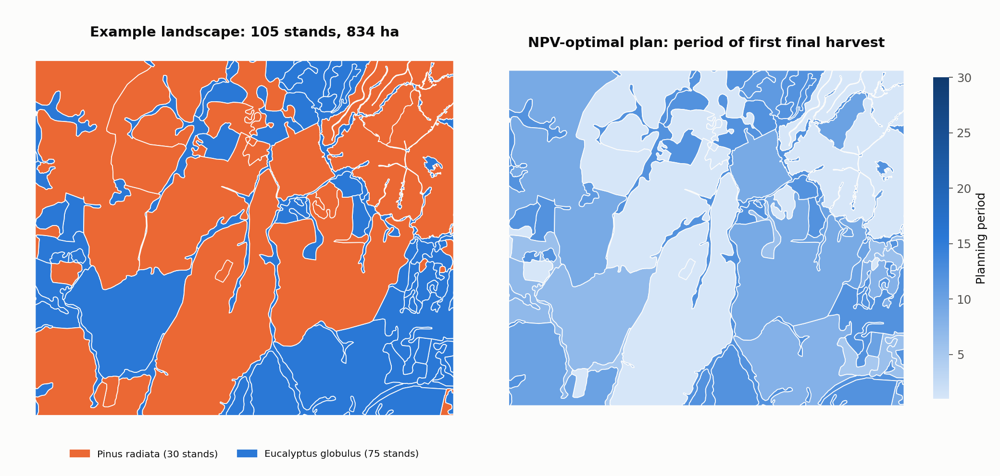

# GIS export

Treemün joins trajectories to stand polygons by `stand_id` and writes GeoPackage layers that open directly in QGIS, ArcGIS or GeoPandas. Requires the `spatial` extra.

Outputs are in **long format**: one feature per stand, policy and year. Filter by `period` to map a single year, or by `policy` to compare alternatives.

## The selected plan

```python
tm.export_optimal_solution_to_geopackage(
    forest=forest,
    solution=solution,                        # from extract_solution, or any dict with "selected_policies"
    geometry_file="examples/treemun_landscape.gpkg",
    output_file="outputs/npv_optimal_plan.gpkg",
    layer="optimal_solution",
)
```

Any plan can be exported, for example the knee point of a three-objective front:

```python
knee_row = knee.loc[knee["is_knee_point"]].iloc[0]
tm.export_optimal_solution_to_geopackage(
    forest=forest,
    solution={"selected_policies": knee_row["selected_policies"]},
    geometry_file="examples/treemun_landscape.gpkg",
    output_file="outputs/knee_plan.gpkg",
    layer="knee_solution",
)
```

## All alternatives

```python
tm.export_simulation_to_geopackage(
    forest=forest,
    geometry_file="examples/treemun_landscape.gpkg",
    output_file="outputs/all_alternatives.gpkg",
    layer="simulation",
)
```

With 780 alternatives × 30 years this is 23,400 features; use it for exploring alternatives, not for final maps.

## Mapping in Python

```python
import geopandas as gpd
import matplotlib.pyplot as plt

plan = gpd.read_file("outputs/npv_optimal_plan.gpkg", layer="optimal_solution")

# Year of the first final harvest of each stand
first_harvest = (
    plan[plan["operation"] == "final_harvest"]
    .groupby("stand_id")["period"].min()
    .rename("first_harvest_period")
)
stands = plan[plan["period"] == 1].merge(first_harvest, on="stand_id", how="left")

ax = stands.plot(column="first_harvest_period", cmap="Blues", legend=True, figsize=(8, 7))
ax.set_axis_off()
plt.show()
```

<figure markdown="span">
  
  <figcaption>Left: stands by species. Right: year of each stand's first final harvest under the NPV-optimal plan.</figcaption>
</figure>

## Notes

- Every `stand_id` in the trajectories must have a polygon, or the export stops with the list of missing IDs.
- Geometries keep the CRS of the input file.
- Use a different `stand_id_column=` if your polygons use another identifier field.
- The KITRAL fuel class in each row (`kitral_class`) can be mapped the same way, for example to link the harvest schedule with fire-behaviour models.
