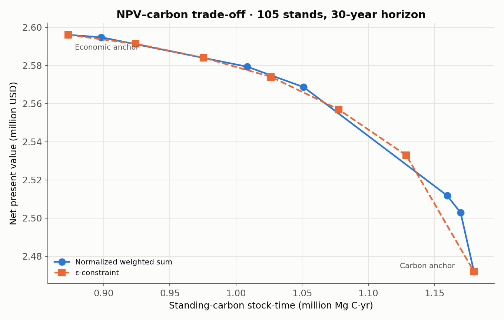

# Multi-objective analysis

NPV and carbon stock-time pull in different directions: holding biomass longer raises carbon but delays revenue. Treemün maps this trade-off with three tools: a **payoff table**, a **normalized weighted sum** and the **ε-constraint** method. All of them take the same `model_options` dictionary as [`build_forest_management_model`](optimization.md).

## Payoff table

The payoff table solves the two single-objective problems (the *anchors*) and evaluates both criteria at each optimum.

```python
payoff = tm.build_biobjective_payoff_table(
    solver_name="appsi_highs",
    solver_options={"relative_gap": 0.0},
    model_options=model_options,
)
payoff[["optimized_for", "economic_value", "carbon_stock_time_tC_year", "ending_dry_wood_t"]]
```

| optimized_for | economic_value (USD) | carbon_stock_time_tC_year | ending_dry_wood_t |
|---|---:|---:|---:|
| economic | 2,596,065 | 873,049 | 29,331 |
| carbon | 2,471,946 | 1,179,847 | 79,394 |

The anchors approximate the ideal and nadir points and give each objective's range: here 124,119 USD and 306,798 Mg C·yr. Each objective is rescaled as (value − reference) / scale, so both run from 0 to 1 between the anchors. `selected_policies` for each anchor is stored in the table.

```python
tm.biobjective_normalization_from_payoff(payoff)
# {'npv_reference': 2471946.3, 'carbon_reference': 873048.7,
#  'npv_scale': 124119.1, 'carbon_scale': 306798.2}
```

## Weighted sum

NPV is in USD and carbon in Mg C·yr, so a raw weighted sum would be dominated by whichever number is larger. `build_weighted_pareto_front` rescales both by their payoff-table range before weighting (`normalization="payoff_range"`, the default):

\[
\max_{\mathbf{x}}\ w_N\, \hat Z_N(\mathbf{x}) + w_C\, \hat Z_C(\mathbf{x}), \qquad w_N + w_C = 1
\]

```python
weighted = tm.build_weighted_pareto_front(
    weights=[0.0, 0.25, 0.5, 0.75, 1.0],   # NPV weights; carbon weight = 1 − w
    solver_name="appsi_highs",
    model_options=model_options,
    payoff_table=payoff,                    # reuse the anchors
)
```

| npv_weight | economic_value | carbon_stock_time_tC_year | ending_dry_wood_t |
|---:|---:|---:|---:|
| 0.00 | 2,471,946 | 1,179,847 | 79,394 |
| 0.50 | 2,568,691 | 1,051,085 | 53,896 |
| 1.00 | 2,596,065 | 873,049 | 29,331 |

The equal-weight plan gains 20.4% carbon stock-time for a 1.05% NPV loss.

## ε-constraint

The ε-constraint method maximizes one objective while requiring a minimum of the other, in natural units:

\[
\max_{\mathbf{x}}\ Z_N(\mathbf{x}) \quad \text{s.t.} \quad Z_C(\mathbf{x}) \ge \varepsilon_C
\]

```python
epsilon = tm.build_epsilon_constraint_front(
    epsilon_objective="carbon",     # constrain carbon, maximize NPV
    number_of_points=7,             # evenly spaced between the anchors
    payoff_table=payoff,
    solver_name="appsi_highs",
    model_options=model_options,
)
```

Use `epsilon_objective="npv"` to maximize carbon subject to a minimum NPV, or pass explicit bounds with `epsilon_values=[...]`.

<figure markdown="span">
  { width="620" }
  <figcaption>Weighted-sum and ε-constraint approximations of the NPV–carbon trade-off on the 105-stand landscape.</figcaption>
</figure>

The two methods sample the same trade-off differently. Weighted sums can only reach solutions on the convex hull and tend to cluster; ε-constraint points are spread evenly in carbon. Both give a **discrete, sampled** approximation, not the full Pareto frontier.

## Filtering dominated points

When you combine results from several runs, keep only the nondominated ones:

```python
import pandas as pd

candidates = pd.concat([weighted, epsilon], ignore_index=True)
front = tm.filter_nondominated_points(
    candidates,
    maximize_columns=("economic_value", "carbon_stock_time_tC_year"),
)
```

## Interpreting the trade-off

On this landscape carbon can be raised substantially for a small NPV loss. Part of that is accounting: NPV is discounted at 8% while carbon stock-time is undiscounted, so carbon held late in the horizon counts fully while the revenue it displaces is heavily discounted. The optimizer also defers harvests first in the stands where this is cheapest. The exchange rate therefore depends on the discount rate, the terminal value and the age structure, and it worsens as the carbon requirement tightens. See the discussion in Ulloa-Fierro et al. (2026), Section 5.

Three objectives (adding spatial green-up conflicts) are covered in [Spatial planning](spatial.md#three-objective-analysis).
