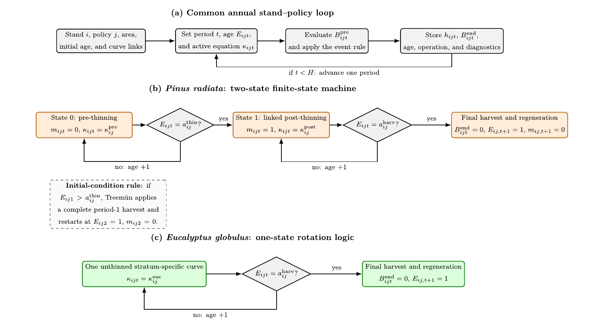
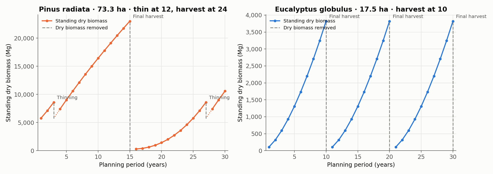
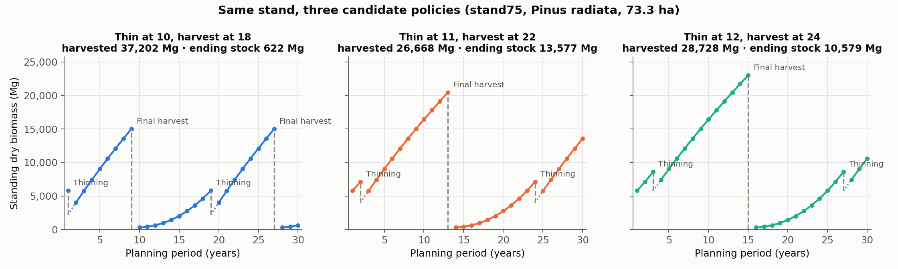

# Simulation

`simulate_forest` grows every stand under every feasible management policy, year by year, and returns the trajectories plus the coefficients the optimizer needs. Nothing is decided here: the simulator only enumerates alternatives.

```python
import treemun_sim as tm

forest, policy_summary, ending_stock, harvest = tm.simulate_forest(
    stands_file="examples/forest_stands.csv",
    horizon=30,
)
```

With `include_carbon=True, return_carbon_for_optimization=True` a fifth object with carbon stock-time coefficients is returned (see [Carbon](carbon.md)).

## How a stand is simulated

<figure markdown="span">
  
  <figcaption>(a) The common annual loop. (b) The two-state logic for pine. (c) The one-state rotation for eucalyptus. Reproduced from Ulloa-Fierro et al. (2026), Fig. 2 (CC BY-NC-ND 4.0).</figcaption>
</figure>

For each stand \(i\), policy \(j\) and year \(t\), Treemün:

1. takes the stand's biological age \(E_{ijt}\) and the active equation;
2. evaluates the standing dry biomass before any operation, \(B^{\text{pre}}_{ijt} = A_i \, b(E_{ijt})\), where \(A_i\) is the area;
3. applies the operation the policy schedules for that age (thinning, final harvest, or none);
4. stores the removal \(h_{ijt}\), the remaining biomass \(B^{\text{end}}_{ijt}\) and diagnostics, then advances one year.

**Pine** has two states. State 0 follows the pre-thinning curve (1,250 → 700 trees ha⁻¹). At the thinning age the stand moves to State 1, the linked post-thinning curve (700 → 300 trees ha⁻¹). At the final-harvest age everything is removed, the stand is replanted, and it restarts at age 1 in State 0.

**Eucalyptus** has one state: a single stratum-specific curve until the rotation age, then harvest and regeneration.

<figure markdown="span">
  
  <figcaption>Left: a 73.3-ha pine stand thinned at 12 and harvested at 24; after harvest a new rotation begins and is thinned again. Right: a 17.5-ha eucalyptus stand on a 10-year rotation.</figcaption>
</figure>

Calendar year and biological age are different things: the year advances uniformly for the whole landscape, while age resets at every final harvest.

## Policies

A policy is a pair *(thinning age, final-harvest age)* for pine and a single *rotation age* for eucalyptus. The defaults are:

```python
tm.DEFAULT_PINUS_POLICIES
# ((9, 18), (9, 20), (9, 22), (9, 24), (10, 18), …, (12, 24))   16 combinations

tm.DEFAULT_EUCALYPTUS_POLICIES
# ((9,), (10,), (11,), (12,))
```

Pass your own catalogue to change them:

```python
forest, *_ = tm.simulate_forest(
    stands_file="examples/forest_stands.csv",
    horizon=40,
    pinus_policies=[(10, 20), (12, 24), (14, 28)],
    eucalyptus_policies=[(8,), (10,), (12,), (14,)],
)
```

Every policy is applied to every stand of the matching species; alternatives that cannot be realized are dropped. With the defaults, the 105-stand example yields 780 alternatives.

<figure markdown="span">
  
  <figcaption>The same pine stand under three policies. Earlier rotations harvest more within the horizon but leave less standing at the end.</figcaption>
</figure>

### Stands already past the thinning age

If a pine stand's initial age is greater than a policy's thinning age, Treemün does **not** assume that an undocumented thinning happened. It harvests the whole stand in year 1 (`final_harvest_reason = "overdue_thinning_rotation_reset"`), replants, and starts year 2 at age 1 on the pre-thinning curve. This keeps the initial stock identical across all policies of a stand, which is what makes ending-stock constraints relative to the initial stock meaningful.

```python
long = tm.forest_to_long_table(forest)
resets = long[long["initial_rotation_reset_triggered"]]
resets["stand_id"].nunique()      # 30 pine stands have at least one such policy
```

## How thinning removals are computed

At the thinning age, the removal is the difference between the pre-thinning curve and the linked post-thinning curve:

\[
R^{\text{thin}}_{ijt} = \max\{A_i\, b_{\text{pre}}(E) - A_i\, b_{\text{post}}(E),\ 0\}
\]

For some strata the post-thinning curve is very low at the thinning age, which would imply removing almost the whole stand. If the post-thinning curve would keep no more than `minimum_curve_residual_fraction` (default 10%) of the stock, Treemün instead removes a fixed `fallback_thinning_fraction` (default 30%). After thinning, the stand keeps the corrected residual stock and grows with the **increments** of the post-thinning curve, so there is no jump.

```python
forest, *_ = tm.simulate_forest(
    stands_file="examples/forest_stands.csv",
    fallback_thinning_fraction=0.35,
    minimum_curve_residual_fraction=0.05,
)
```

The method used is recorded in each row:

| Column | Meaning |
|---|---|
| `thinning_calculation_method` | `curve_difference`, `fixed_fraction_fallback`, or `not_applicable` |
| `thinning_fallback_triggered` | `True` when the fallback was used |
| `candidate_post_thinning_dry_wood_t` | stock the post-thinning curve alone would imply |
| `candidate_curve_residual_fraction` | that stock as a fraction of the pre-thinning stock |
| `applied_thinning_fraction` | share of the stock actually removed |
| `post_thinning_continuity_adjustment_t` | offset applied to keep growth continuous after thinning |

In the 105-stand example, 463 thinnings use the curve difference and 200 use the fallback.

## Trajectory columns

Each DataFrame in `forest` has one row per year. The main columns:

| Column | Unit | Meaning |
|---|---|---|
| `period` | year | 1 … horizon |
| `stand_id`, `species`, `area_ha` | | stand attributes |
| `policy`, `policy_number`, `thinning_age`, `final_harvest_age` | | policy attributes |
| `stand_age` | years | biological age in this year |
| `operation` | | `none`, `thinning`, or `final_harvest` |
| `final_harvest_reason` | | `scheduled_final_harvest`, `overdue_thinning_rotation_reset`, or `not_applicable` |
| `management_state` | | `unthinned` until a thinning, `post_thinning` afterwards |
| `growth_curve_before_operation`, `equation_id_before_operation` | | active curve |
| `standing_dry_wood_t_before_operation` | Mg | stock before the operation |
| `harvested_dry_wood_t` | Mg | removed this year |
| `standing_dry_wood_t_after_operation` | Mg | stock after the operation |
| `kitral_class` | | KITRAL fuel-model class (e.g. `PL01`–`PL10`) |

`forest_to_long_table(forest)` stacks all trajectories into one DataFrame. `policy_summary` lists each alternative with its initial and ending age, ages of intervention and initial equation. `ending_stock` maps `(stand_id, policy)` to the dry biomass standing at the end of the horizon.

### Fuel classes

Each row carries a KITRAL fuel-model class derived from species, age and management status. This lets you follow fuel development over the horizon, for example as input to fire-risk assessments or to link harvest planning with fire-behaviour simulators.

## Random landscapes

Without `stands_file`, Treemün generates `number_of_stands` random stands from the lookup table (reproducible through `random_seed`). This is useful for tests and scaling experiments:

```python
forest, *_ = tm.simulate_forest(number_of_stands=500, horizon=30, random_seed=42)
```
