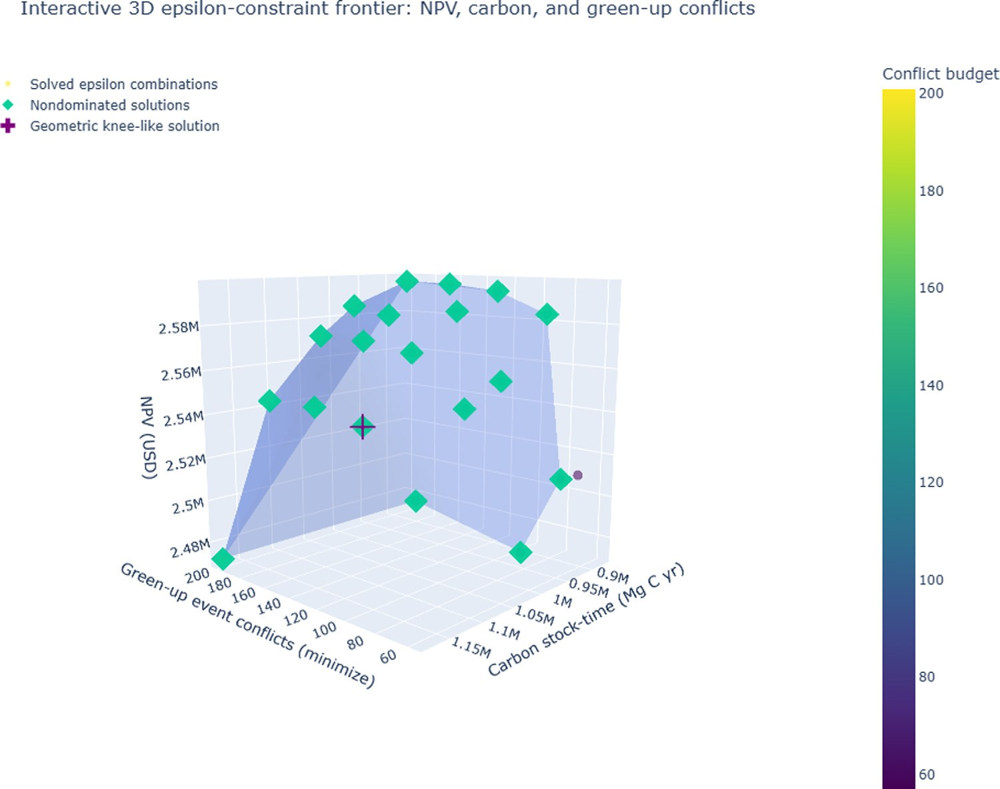

# Spatial planning

With stand polygons, Treemün can coordinate **when neighbouring stands are harvested**. The spatial layer adds adjacency and green-up constraints to any model from [Optimization](optimization.md), or treats green-up conflicts as a third objective.

Requires the `spatial` and `optimization` extras.

## Adjacency

```python
edges = tm.build_adjacency_edges(
    "examples/treemun_landscape.gpkg",
    minimum_shared_boundary=0.0,     # ignore contacts shorter than this (map units)
)
edges.head()
```

The result is a DataFrame with columns `stand_id_a`, `stand_id_b` and `shared_boundary_length`, one row per adjacent pair.

Two stands are adjacent when their boundaries share a line segment longer than `minimum_shared_boundary`. The example landscape has **215 adjacency edges**. A projected CRS is required.

You also need, for every alternative, the years in which it performs a final harvest:

```python
indicator = tm.build_final_harvest_indicator(forest)   # {(stand_id, policy, period): 1}
```

## Green-up event conflicts

A **green-up event conflict** occurs when two adjacent stands both have a final harvest within `greenup_window` years of each other. With `greenup_window=0` only simultaneous harvests count; with `greenup_window=2`, harvests up to two years apart count.

Count the conflicts of any plan, for example the economic optimum:

```python
conflicts = tm.count_greenup_event_conflicts(
    selected_policies=solution["selected_policies"],
    forest=forest,
    adjacency_edges=edges,
    greenup_window=2,
)
len(conflicts)     # 200 for the NPV-optimal plan
```

Each conflicting pair of harvest events counts once, regardless of stand size or boundary length. Set `weight_by_shared_boundary=True` in the functions below to weight each conflict by the shared-boundary length instead.

## Hard and soft constraints

```python
model = tm.build_forest_management_model(**model_options, objective="economic")

tm.add_greenup_adjacency(
    model,
    adjacency_edges=edges,
    final_harvest_indicator=indicator,
    greenup_window=2,
    mode="hard",        # forbid all conflicts
)
results = tm.solve_model(model, "appsi_highs")
```

- `mode="hard"` forbids any conflict. On the example landscape this is **infeasible**: the policy catalogue cannot separate every pair of neighbours by more than two years.
- `mode="soft"` subtracts `penalty` × conflicts from the objective. With the example data a soft penalty lowered conflicts from 200 to 183 for a 0.15% NPV loss.

`add_final_harvest_adjacency(...)` is the special case that only prevents or penalizes **same-year** harvests of neighbours.

To measure conflicts without changing the objective (for example to constrain them yourself):

```python
tm.add_greenup_event_conflict_measure(
    model,
    adjacency_edges=edges,
    final_harvest_indicator=indicator,
    greenup_window=2,
)
model.greenup_event_conflict_value     # Pyomo expression
```

## Three-objective analysis

The three-objective model maximizes NPV and carbon while minimizing conflicts:

\[
\max \{Z_N(\mathbf{x}),\ Z_C(\mathbf{x}),\ -G(\mathbf{z})\}
\]

It is sampled with a two-threshold ε-constraint: maximize NPV subject to \(Z_C \ge \varepsilon_C\) and \(G \le \varepsilon_G\).

```python
# 1. Anchors. The economic and carbon anchors of the bi-objective payoff table are reused;
#    only the minimum-conflict anchor needs new spatial solves.
payoff_3d = tm.build_three_objective_payoff_table(
    adjacency_edges=edges,
    final_harvest_indicator=indicator,
    greenup_window=2,
    biobjective_payoff_table=payoff,
    solver_name="appsi_highs",
    model_options=model_options,
)

# 2. A grid of carbon lower bounds × conflict upper bounds
front_3d = tm.build_three_objective_epsilon_front(
    adjacency_edges=edges,
    final_harvest_indicator=indicator,
    greenup_window=2,
    number_of_carbon_points=5,
    number_of_greenup_points=5,
    payoff_table=payoff_3d,
    solver_name="appsi_highs",
    model_options=model_options,
)

# 3. A compromise: the knee point
knee = tm.identify_three_objective_knee_point(front_3d, payoff_table=payoff_3d)
knee.loc[knee["is_knee_point"]]
```

The front builder avoids redundant solves: before building a spatial MILP it checks whether an anchor or an already-solved looser combination is still feasible, and therefore still optimal, under the stricter bounds. `solution_source` tells you where each row came from (`new_epsilon_solve`, `reused_economic_anchor`, `reused_greenup_anchor`, `reused_cached_epsilon_solution`), and `front_3d.attrs` reports the solver calls avoided.

`identify_three_objective_knee_point` normalizes the three objectives, fits the plane through the three anchors, and marks the point farthest from it towards the ideal. It is a transparent geometric rule, not a universally preferred solution.

<figure markdown="span">
  { width="620" }
  <figcaption>Sampled three-objective ε-constraint approximation for the 105-stand landscape (green: nondominated solutions; cross: knee-like solution). Reproduced from Ulloa-Fierro et al. (2026), Fig. 9a (CC BY-NC-ND 4.0).</figcaption>
</figure>

Selected solutions on the example landscape (1% MIP gap):

| Solution | NPV (USD) | Carbon stock-time (Mg C·yr) | Green-up conflicts |
|---|---:|---:|---:|
| Economic anchor | 2,596,065 | 873,049 | 200 |
| Carbon anchor | 2,471,946 | 1,179,847 | 201 |
| Minimum-conflict anchor | 2,514,148 | 922,244 | 57 |
| Knee-like solution | 2,538,706 | 1,103,148 | 129 |

Source: Ulloa-Fierro et al. (2026), Table 7.

!!! warning "Spatial models are expensive"
    Conflict variables couple neighbouring stands and make the MILP much harder. In the paper, the spatial payoff table took about 11 minutes and the 5 × 5 grid about 72 minutes with CPLEX, compared with seconds for non-spatial models. Start with a coarse grid, use a relative gap (e.g. 1%) and a time limit, and interpret the result as a sampled near-optimal approximation.

The complete worked example, including an interactive 3D Plotly figure, is in [`examples/Treemun_2_0_0_full_105_stands_analysis.ipynb`](https://github.com/fulloaf/treemun/blob/main/examples/Treemun_2_0_0_full_105_stands_analysis.ipynb).
