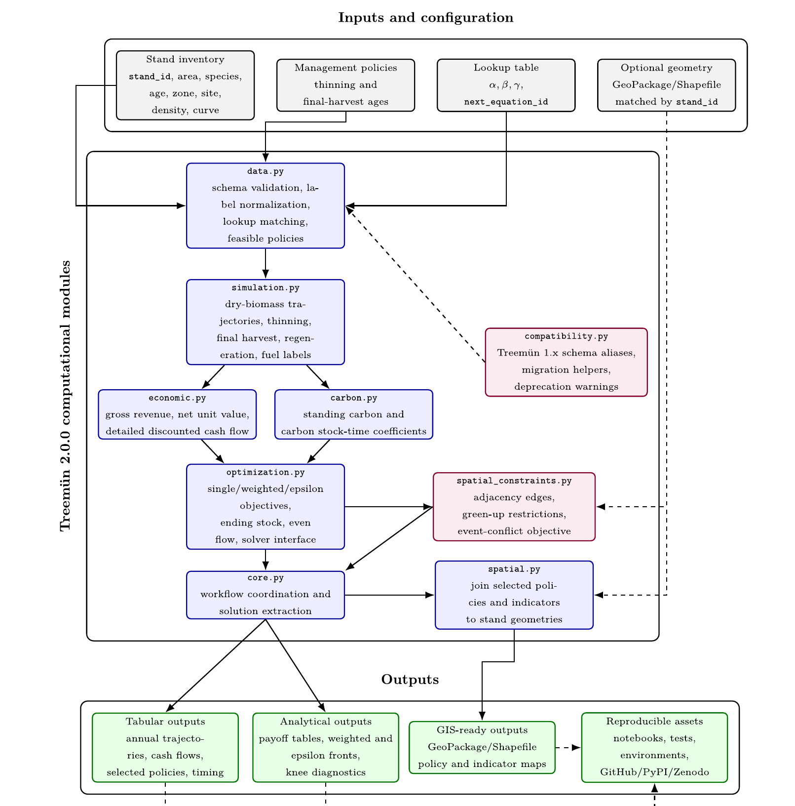

# Treemün

**Growth-and-yield simulation and harvest-scheduling optimization for plantation forests, in Python.**

Treemün connects published growth trajectories for Chilean *Pinus radiata* and *Eucalyptus globulus* plantations to landscape-level management decisions. It turns a stand inventory into every feasible management trajectory, prices each one economically and in carbon terms, and chooses the best combination for the whole landscape with a mixed-integer program. The result can be exported to GIS and mapped.

<figure markdown="span">
  { width="520" }
  <figcaption>Data-flow architecture of Treemün 2.0.0. Reproduced from Ulloa-Fierro et al. (2026), Fig. 5 (CC BY-NC-ND 4.0).</figcaption>
</figure>

## The workflow in one picture

| Step | What happens | Main function |
|---|---|---|
| 1. Load | Stand inventory is validated against the growth-equation lookup table | `load_stand_table` |
| 2. Simulate | Every stand × policy combination is grown year by year: thinning, final harvest, regeneration | `simulate_forest` |
| 3. Evaluate | Each trajectory gets an economic value and a carbon stock-time coefficient | `evaluate_forest_economics` |
| 4. Optimize | One policy per stand is chosen to maximize NPV, carbon, or a trade-off, under optional constraints | `build_forest_management_model`, `solve_model` |
| 5. Explore | Payoff tables, weighted and ε-constraint fronts, green-up conflicts, knee points | `build_weighted_pareto_front`, `build_three_objective_epsilon_front` |
| 6. Map | Selected plan joined to stand polygons and written to GeoPackage | `export_optimal_solution_to_geopackage` |

## Where to start

- **[Installation](getting-started/installation.md)**: pip extras, solvers, Conda environments.
- **[Quickstart](getting-started/quickstart.md)**: the 105-stand landscape of the paper, from CSV to map.
- **[User guide](guide/input-data.md)**: each module explained with runnable examples.
- **[API reference](reference/api.md)**: every public function and its parameters.

## What Treemün is (and is not)

Treemün is an **auditable bridge** between published growth-and-yield tables and mathematical programming. It is not a new growth model: its 34 surrogate equations reproduce existing Chilean production tables (R² = 0.9982 against 526 tabulated values) and inherit their scope. It is deterministic: prices, growth and disturbances are fixed inputs. The carbon indicator covers standing aboveground live biomass only. See [Growth models](reference/growth-models.md) for the exact strata covered.

Within that scope, every modelling assumption is explicit and replaceable: the lookup table, the policy catalogue, carbon fractions, and every price and cost.

## Units and conventions

- Biomass is in **Mg (metric tonnes) of dry aboveground biomass**. Column names use the suffix `_t`, e.g. `harvested_dry_wood_t`.
- Carbon is standing aboveground live carbon in Mg C (`_tC`); the optimization indicator is carbon **stock-time** in Mg C·yr (`_tC_year`).
- Periods are years (`period` = 1 … horizon); `stand_age` is the biological age, which resets after each final harvest.
- Monetary values are in whatever currency and base year your economic parameters use.

## Citing

If Treemün supports your work, please cite [Ulloa-Fierro et al. (2026), *Ecological Informatics* 99, 104044](https://doi.org/10.1016/j.ecoinf.2026.104044). See [How to cite](citing.md) for BibTeX.
