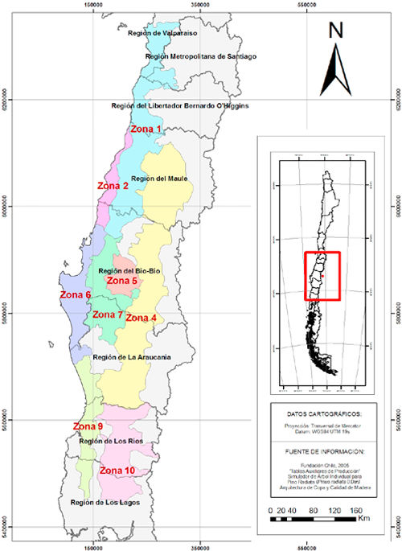
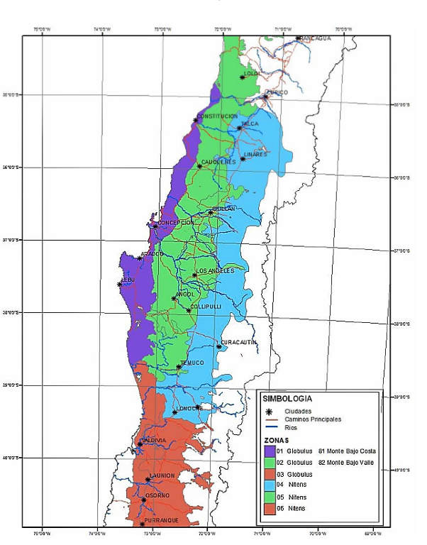

# Growth models

Treemün's biological component is a set of **34 continuous surrogate functions** of dry aboveground biomass, fitted in earlier work to published Chilean production tables for *Pinus radiata* (INSIGNE v1.2.2 volume projections with age-dependent wood density and a biomass-partition model) and *Eucalyptus globulus* (EUCASIM v4.4 projections and associated biomass studies). Treemün distributes the published coefficients; it does not re-estimate them.

## Functional form

For equation \(k\) and biological age \(e\) (years):

\[
b_k(e) = \max\left\{\alpha_k\, e^{\beta_k} + \gamma_k,\ 0\right\} \qquad [\text{Mg ha}^{-1}]
\]

Stand-level biomass is \(A_i\, b_k(e)\), with \(A_i\) the stand area in hectares.

## Strata covered

| Dimension | *Pinus radiata* | *Eucalyptus globulus* |
|---|---|---|
| Geographical zones | 6 and 7 | 1 and 2 |
| Site index (m at age 10) | 23, 26, 29, 32 | 24, 26, 28, 30, 32 |
| Initial density (trees ha⁻¹) | 1250 | 800 or 1250 |
| Management regime | pulpwood, multipurpose, intensive-1, intensive-2 | no intermediate treatment |
| Growth-curve states | unthinned, pre-thinning, linked post-thinning | unthinned |
| Surrogate equations | 14 | 20 |

The pulpwood pine equations are unthinned and, in version 2.0.0, are not accepted as initial stand conditions (see [Input data](../guide/input-data.md#stand-table)).

{ width="300" }

{ width="300" }

Growth zones for *P. radiata* (left) and *E. globulus* (right); cartographic sources are credited on each map. The zones describe the regional support of the source models (Hernández and Corvalán, 2011; Corvalán and Hernández, 2012), not the locations of original measurements.

## Fidelity to the source tables

Against 526 tabulated values:

| Group | n | RMSE (Mg ha⁻¹) | MAE (Mg ha⁻¹) | Bias (Mg ha⁻¹) | MAPE (%) | R² |
|---|---:|---:|---:|---:|---:|---:|
| *E. globulus* | 320 | 5.68 | 4.65 | 1.08 | 4.98 | 0.9988 |
| *P. radiata* | 206 | 7.34 | 5.71 | 0.02 | 5.20 | 0.9958 |
| Overall | 526 | 6.38 | 5.06 | 0.67 | 5.07 | 0.9982 |

Source: Ulloa-Fierro et al. (2026), Table 2. The largest residuals are in post-thinning and pulpwood pine trajectories.

These statistics measure how well the surrogates reproduce the tables they were derived from. They are **not** an independent validation against field data. The benchmark notebook `benchmark_notebooks_and_generator/Treemun_2_0_0_surrogate_vs_source_tables_benchmark_Mg_harmonized.ipynb` and the original tables `DatosArmonizados_Plantaciones_VFinal.csv/.xlsm` let you reproduce them.

When the surrogate functions and the source tables are each used to optimize the same landscape, the two plans agree on 68.6% of stands, and the surrogate plan retains 99.14% of the table-based optimum NPV (regret 0.86%).

## Coefficients

### *Eucalyptus globulus*

| `equation_id` | Zone | Density | Site index | Regime | Growth curve | `next_equation_id` | α | β | γ |
|---:|---:|---:|---:|---|---|---:|---:|---:|---:|
| 1 | 1 | 800 | 24 | `none` | `unthinned` |  | 2.371 | 1.778 | 0.000 |
| 2 | 1 | 800 | 26 | `none` | `unthinned` |  | 2.371 | 1.778 | 0.000 |
| 3 | 1 | 800 | 28 | `none` | `unthinned` |  | 5.464 | 1.591 | 0.000 |
| 4 | 1 | 800 | 30 | `none` | `unthinned` |  | 7.709 | 1.519 | 0.000 |
| 5 | 1 | 800 | 32 | `none` | `unthinned` |  | 10.228 | 1.462 | 6.240 |
| 6 | 1 | 1250 | 24 | `none` | `unthinned` |  | 2.379 | 1.774 | 0.000 |
| 7 | 1 | 1250 | 26 | `none` | `unthinned` |  | 3.794 | 1.666 | 0.000 |
| 8 | 1 | 1250 | 28 | `none` | `unthinned` |  | 5.307 | 1.600 | 0.000 |
| 9 | 1 | 1250 | 30 | `none` | `unthinned` |  | 7.779 | 1.513 | 0.000 |
| 10 | 1 | 1250 | 32 | `none` | `unthinned` |  | 10.304 | 1.457 | 5.660 |
| 11 | 2 | 800 | 24 | `none` | `unthinned` |  | 3.221 | 1.647 | 0.000 |
| 12 | 2 | 800 | 26 | `none` | `unthinned` |  | 3.612 | 1.656 | 0.000 |
| 13 | 2 | 800 | 28 | `none` | `unthinned` |  | 4.559 | 1.618 | 0.000 |
| 14 | 2 | 800 | 30 | `none` | `unthinned` |  | 5.926 | 1.567 | 0.000 |
| 15 | 2 | 800 | 32 | `none` | `unthinned` |  | 7.300 | 1.532 | 0.000 |
| 16 | 2 | 1250 | 24 | `none` | `unthinned` |  | 3.197 | 1.650 | 0.000 |
| 17 | 2 | 1250 | 26 | `none` | `unthinned` |  | 3.729 | 1.645 | 0.000 |
| 18 | 2 | 1250 | 28 | `none` | `unthinned` |  | 5.129 | 1.574 | 0.000 |
| 19 | 2 | 1250 | 30 | `none` | `unthinned` |  | 6.201 | 1.547 | 0.000 |
| 20 | 2 | 1250 | 32 | `none` | `unthinned` |  | 7.592 | 1.514 | 0.000 |

### *Pinus radiata*

| `equation_id` | Zone | Density | Site index | Regime | Growth curve | `next_equation_id` | α | β | γ |
|---:|---:|---:|---:|---|---|---:|---:|---:|---:|
| 21 | 6 | 1250 | 32 | `intensive_1` | `pre_thinning_1250_700` | 23 | 0.421 | 2.253 | 3.485 |
| 22 | 7 | 1250 | 32 | `intensive_1` | `pre_thinning_1250_700` | 24 | 0.576 | 2.044 | 3.968 |
| 23 | 6 | 1250 | 32 | `intensive_1` | `post_thinning_700_300` |  | 122.491 | 0.562 | -416.814 |
| 24 | 7 | 1250 | 32 | `intensive_1` | `post_thinning_700_300` |  | 22.934 | 0.936 | -171.991 |
| 25 | 6 | 1250 | 29 | `intensive_2` | `pre_thinning_1250_700` | 27 | 0.421 | 2.253 | 3.485 |
| 26 | 7 | 1250 | 29 | `intensive_2` | `pre_thinning_1250_700` | 28 | 0.070 | 2.850 | 7.522 |
| 27 | 6 | 1250 | 29 | `intensive_2` | `post_thinning_700_300` |  | 122.491 | 0.562 | -416.814 |
| 28 | 7 | 1250 | 29 | `intensive_2` | `post_thinning_700_300` |  | 40.929 | 0.774 | -227.526 |
| 29 | 6 | 1250 | 26 | `multipurpose` | `pre_thinning_1250_700` | 31 | 0.069 | 2.791 | 1.441 |
| 30 | 7 | 1250 | 26 | `multipurpose` | `pre_thinning_1250_700` | 32 | 0.047 | 2.905 | 8.454 |
| 31 | 6 | 1250 | 26 | `multipurpose` | `post_thinning_700_300` |  | 58.378 | 0.701 | -298.450 |
| 32 | 7 | 1250 | 26 | `multipurpose` | `post_thinning_700_300` |  | 56.816 | 0.666 | -260.576 |
| 33 | 6 | 1250 | 23 | `pulpwood` | `unthinned` |  | 9.592 | 1.169 | -97.246 |
| 34 | 7 | 1250 | 23 | `pulpwood` | `unthinned` |  | 20.852 | 0.844 | -103.893 |

To use other coefficients or strata, copy `treemun_sim/data/lookup_table.csv`, edit it, and pass it with `simulate_forest(..., lookup_table_file=...)`. Keep the columns and the `next_equation_id` links for pine.
